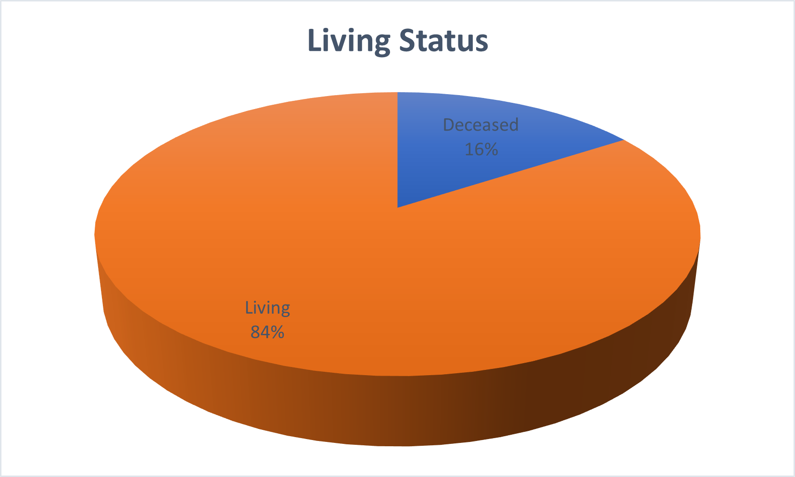
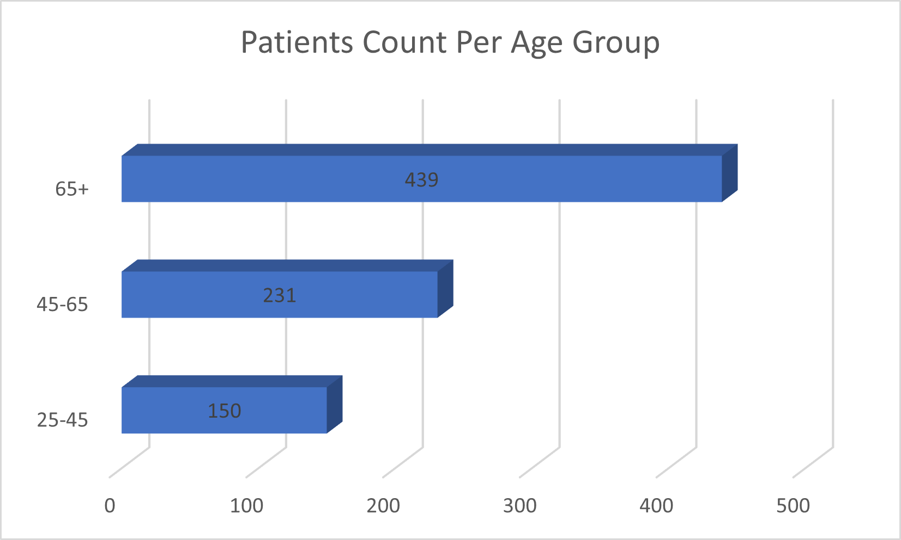
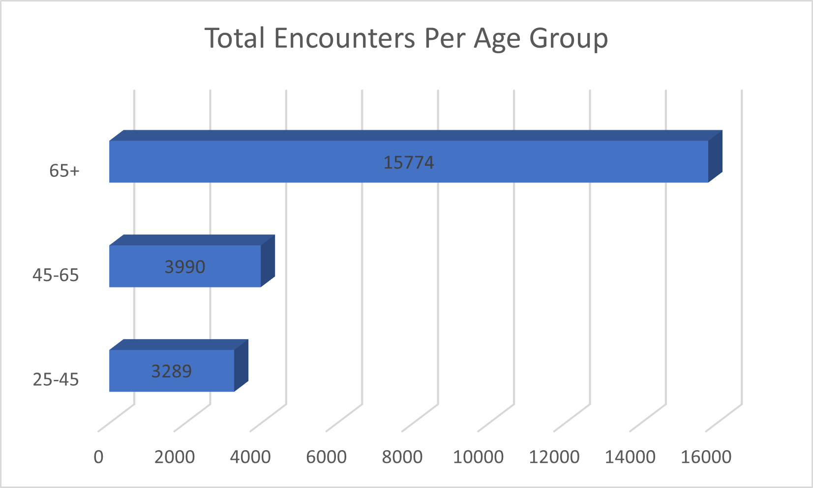
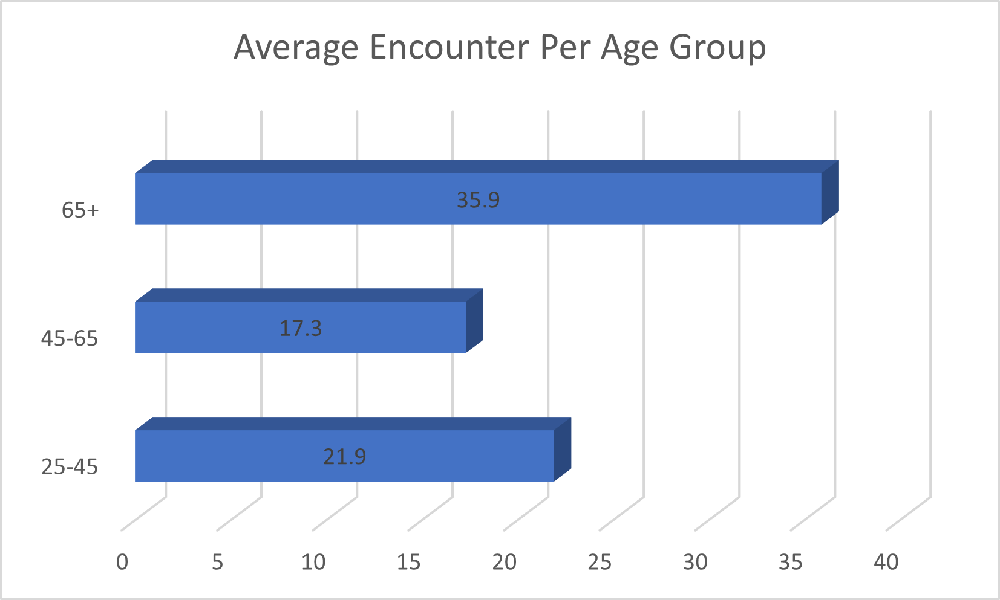

# Hospital Utilization & Revenue Risk Analysis  
SQL Insights from Patient Records (Maven Analytics)

## Executive Summary
- **Aging population is driving high resource use**: Patients 65+ average **6.3 encounters** per person — 2.3× more than the 25–45 group (2.7 encounters) — highlighting the need for expanded geriatric and chronic care capacity.
- **Significant uninsured exposure**: Approximately **27%** of encounters have zero payer coverage, creating potential bad debt and revenue risk.
- **Preventive care focus**: Top procedures are screenings (medication reconciliation, depression screening, substance use assessment) — strong opportunity to scale wellness programs for better long-term outcomes.
- **Billing/documentation gaps**: **18.6%** of patients with encounters (181 individuals) have no recorded procedures — likely leading to missed charges or incomplete records.
- **Financial disparities visible**: High-cost cases show varying insurance support, with some patients facing substantial out-of-pocket burdens despite coverage.

## Table of Contents
- [Key Insights & Visuals](#key-insights--visuals)
- [Recommendations](#recommendations)
- [Data Source & Overview](#data-source--overview)
- [Technical Details](#technical-details)

## Key Insights & Visuals

  
**Alive: 820** | **Deceased: 154** → High survival rate; strong foundation for preventive and chronic care programs.

  
  

- **65+ patients consume significantly more healthcare resources** (6.3 avg encounters vs. 2.7 in younger groups).
- **45–64 age group** has the highest total encounter volume, but lower per-patient frequency — younger cohorts drive more repeat visits.
- **Top procedures are preventive** → aligns well with managing chronic conditions in an aging population.
- **Uninsured burden** → ~27% of encounters self-paid; individual cases show high costs with partial or no coverage.
- **18.6% of patients** with encounters lack any procedures → points to potential documentation, billing, or process gaps.

## Recommendations
1. Increase geriatric and chronic disease management staffing to better handle the 2.3× higher utilization from patients 65+.
2. Expand preventive screening and wellness programs (focus on medication reconciliation, depression, substance use) to reduce future chronic costs.
3. Develop outreach with social workers to assist uninsured/self-paid patients (~27% of encounters) with insurance enrollment or financial aid programs → reduce bad debt risk.
4. Audit encounters without recorded procedures (181 patients) to identify and fix documentation/billing gaps → improve revenue capture and data quality.

## Data Source & Overview
- Synthetic Hospital Patient Records dataset from [Maven Analytics](https://mavenanalytics.io/data-playground/hospital-patient-records).
- PostgreSQL analysis: 974 patients, 27,891 encounters, data spanning 2011–2022.
- Ages calculated as of 2023-01-01; synthetic data (no real PHI).
- Quick setup: `CREATE DATABASE hospital;` → import CSVs via pgAdmin or psql.

**Entity Relationship Diagram** (add image when ready):  

## Technical Details
All SQL analysis is in the [sql/ folder](sql/). Organized by topic:

- Demographics: `living-vs-deceased.sql`, `age-group-distribution.sql`
- Utilization & Trends: `encounters-by-year.sql`, `encounter-class-pct-by-year.sql`
- Procedures: `top-10-frequent-procedures.sql`, `top-5-procedures.sql`, `top-procedures-by-gender.sql`, `top-10-highest-avg-cost-procedures.sql`
- Financial & Insurance: `uninsured-encounters-pct.sql`, `uninsured-patients-summary.sql`, `claims-by-payer-insurance-status.sql`, `avg-claim-cost-by-payer.sql`, `cost-and-coverage-per-patient.sql`
- Data Quality: `patients-encounters-no-procedures.sql`, `invalid-dates-check.sql`

Data Cleaning Summary (click to expand)

- NULLs in optional fields (suffix, maiden, zip) treated as valid.
- Categorical codes interpreted consistently (marital: S/M, gender: M/F).
- Synthetic names with non-alphabetic characters expected — no impact on analysis.
- No invalid dates found (birthdate ≥ deathdate).

