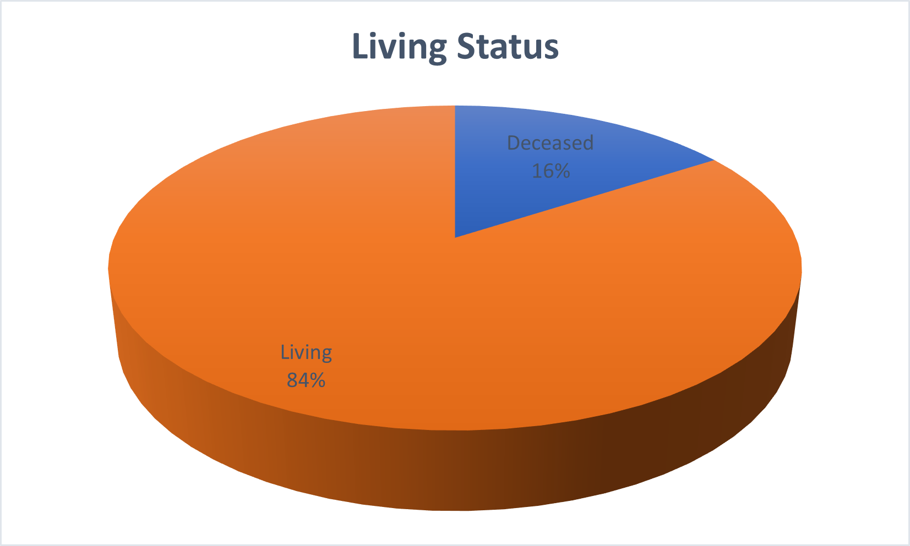
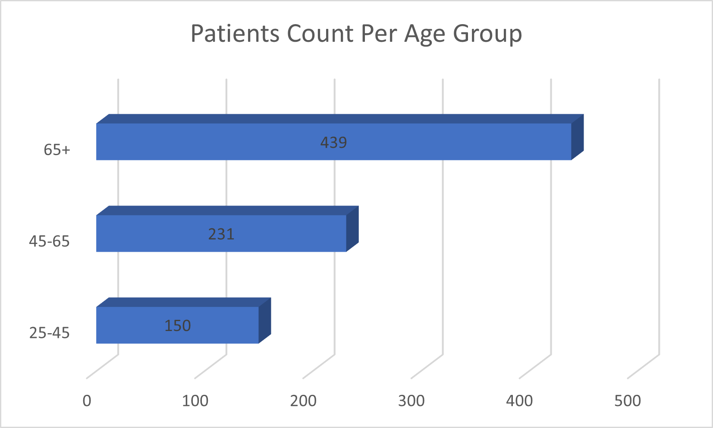
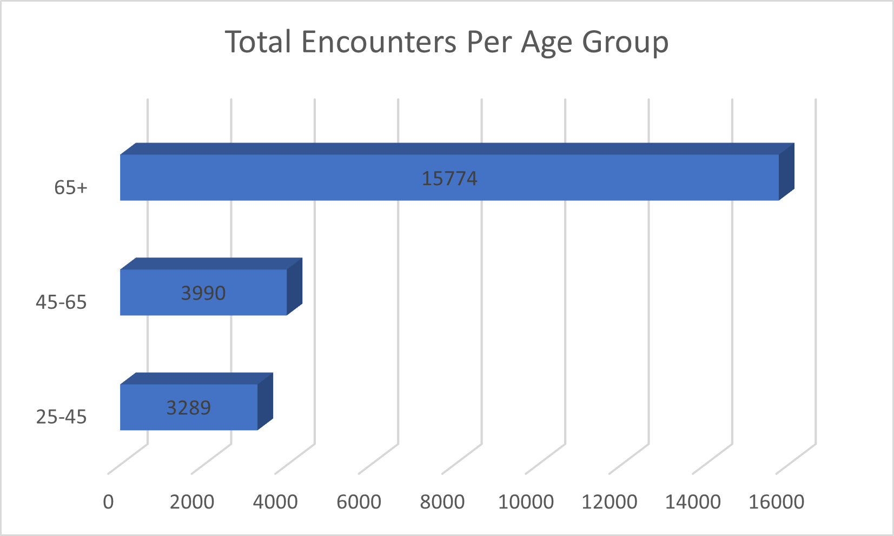
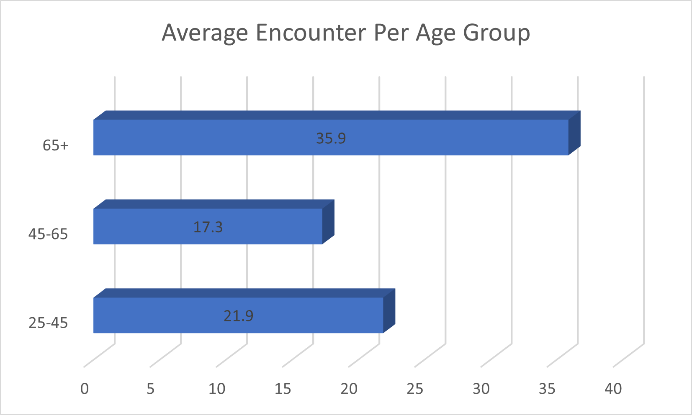

# Hospital Utilization & Revenue Risk Analysis  
SQL Insights from Patient Records (Maven Analytics)

## Project Background
As part of building practical data analysis skills for healthcare operations roles, I analyzed a synthetic hospital patient dataset to simulate real-world questions that hospital finance, revenue cycle, and operations teams face every day.

The goal was to move beyond basic counts and explore **cost-weighted patterns**, **resource utilization by patient segment**, and **potential revenue risks** — the kinds of insights that actually influence staffing decisions, preventive program budgets, bad debt reserves, and documentation audits.

Key focus areas:
- How does an aging patient population affect encounter volume and resource demand?
- What portion of billed revenue comes from uninsured/self-pay encounters, and how concentrated is that risk?
- Are there documentation or billing gaps that could be quietly leaking revenue?

All analysis was done in PostgreSQL using only SQL (no Python or BI tools for the core work), with results framed for non-technical stakeholders such as hospital CFOs, revenue cycle managers, or clinical operations leads.
- SQL queries for data inspection, quality checks (e.g., invalid dates, no-procedure encounters), demographics, utilization trends, procedures, financial breakdowns, and insurance analysis are organized in the [sql/ folder](sql/).

Dataset: Maven Hospital Patient Records from Maven Analytics (974 patients, 27,891 encounters, 2011–2022).  
All data is fictional and contains no real PHI.

This project reflects the type of quick, high-value analysis I aim to deliver in a junior/mid-level data analyst role — turning raw encounter and claims data into clear business risks and actionable recommendations.

## Executive Summary
- **Aging population is driving high resource use**: Patients 65+ average **6.3 encounters** per person — 2.3× more than the 25–45 group (2.7 encounters) — highlighting the need for expanded geriatric and chronic care capacity.
- **Significant Uninsured Exposure**: Approximately **48%** of encounters have zero payer coverage, generating **$63.1M** in potential bad debt — representing **62%** of total hospital costs — creating substantial revenue risk for Maven Hospital.
- (62% of costs) signals urgent need for payer mix improvement and financial navigation support

- **Preventive care focus**: Top procedures are screenings (medication reconciliation, depression screening, substance use assessment) — strong opportunity to scale wellness programs for better long-term outcomes.
- **Billing/documentation gaps**: **18.6%** of patients with encounters (181 individuals) have no recorded procedures — likely leading to missed charges or incomplete records.
- **Financial disparities visible**: High-cost cases show varying insurance support, with some patients facing substantial out-of-pocket burdens despite coverage.

## Table of Contents
- [Key Insights & Visuals](#key-insights--visuals)
- [Recommendations](#recommendations)
- [Data Source & Overview](#data-source--overview)
- [Technical Details](#technical-details)

## Key Insights & Visuals

  
**Alive: 820** | **Deceased: 154** → High survival rate; strong foundation for preventive and chronic care programs.

  
  

- **65+ patients consume significantly more healthcare resources** (6.3 avg encounters vs. 2.7 in younger groups).
- **45–64 age group** has the highest total encounter volume, but lower per-patient frequency — younger cohorts drive more repeat visits.
- **Top procedures are preventive** → aligns well with managing chronic conditions in an aging population.
- **Uninsured burden** → ~27% of encounters self-paid; individual cases show high costs with partial or no coverage.
- **18.6% of patients** with encounters lack any procedures → points to potential documentation, billing, or process gaps.

## Recommendations
1. Increase geriatric and chronic disease management staffing to better handle the 2.3× higher utilization from patients 65+.
2. Expand preventive screening and wellness programs (focus on medication reconciliation, depression, substance use) to reduce future chronic costs.
3. Develop outreach with social workers to assist uninsured/self-paid patients (~27% of encounters) with insurance enrollment or financial aid programs → reduce bad debt risk.
4. Audit encounters without recorded procedures (181 patients) to identify and fix documentation/billing gaps → improve revenue capture and data quality.

**Entity Relationship Diagram** (add image when ready):  

## Technical Details
All SQL analysis is in the [sql/ folder](sql/). Organized by topic:

- Demographics: `living-vs-deceased.sql`, `age-group-distribution.sql`
- Utilization & Trends: `encounters-by-year.sql`, `encounter-class-pct-by-year.sql`
- Procedures: `top-10-frequent-procedures.sql`, `top-5-procedures.sql`, `top-procedures-by-gender.sql`, `top-10-highest-avg-cost-procedures.sql`
- Financial & Insurance: `uninsured-encounters-pct.sql`, `uninsured-patients-summary.sql`, `claims-by-payer-insurance-status.sql`, `avg-claim-cost-by-payer.sql`, `cost-and-coverage-per-patient.sql`
- Data Quality: `patients-encounters-no-procedures.sql`, `invalid-dates-check.sql`

Data Cleaning Summary (click to expand)

- NULLs in optional fields (suffix, maiden, zip) treated as valid.
- Categorical codes interpreted consistently (marital: S/M, gender: M/F).
- Synthetic names with non-alphabetic characters expected — no impact on analysis.
- No invalid dates found (birthdate ≥ deathdate).

